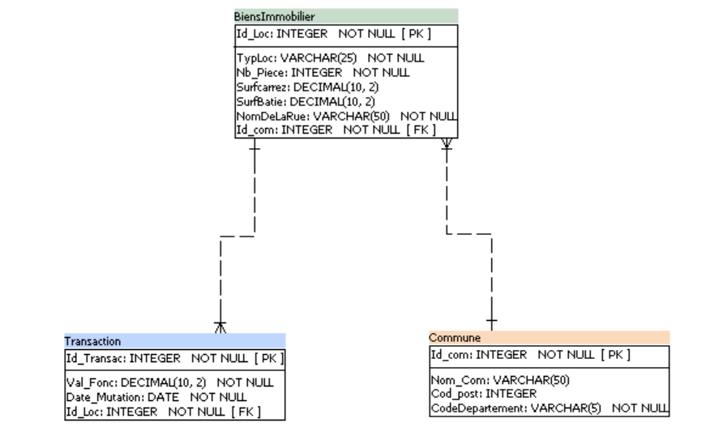

# Modèle de recommandation du prix de vente de l'immobilier avec SQL.

 Dans ce projet, nous avons construit un modèle de recommandation des prix de l'immobilier en France avec SQL
 Les données utilisées : [Demandes de valeurs foncières](https://www.data.gouv.fr/fr/datasets/5c4ae55a634f4117716d5656/) data from [Data.gouv](https://www.data.gouv.fr/fr/).
 
 
###  Dictionnaire de données : 

### Nettoyage des données
Nous avons utilisé **Excel** et **Power Query** pour la préparation des données.

### Conception de la bases de données
Nous avons utilisé **Power Architect** pour concevoir la base de données.

### Le modèle 

Nous avons utilisé **MySQL** pour implémenter le modèle.

### Contenu du projet:

1 Dictionnaire de données.

1 Modèles de conception relationnels.

1 Le schéma relationnel.

1 script de création de tables en MySQL.

4 fichiers de données nettoyés.

9 requêtes MySQL.

